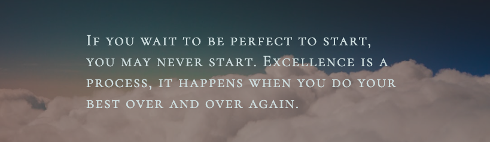

<h1 align="center">👋 Hi, I'm Sarah !</h1>
<h3 align="center">I'm a passionate 4th-year Computer Engineering student at Birzeit University, eager to explore innovative projects in AI, Hardware, and Software development!</h3>

<h1 align="center">

---

<h3 align="left">🌐 Connect with Me On LinkedIn:</h3>

  

---

<h3 align="left">🛠️ Technologies I'm Proficient In:</h3>
<ul>
  <li>Java</li>
  <li>Python</li>
  <li>Verilog</li>
  <li>SystemVerilog</li>
  <li>C</li>
</ul>

---

<h3 align="left">🧠 Currently Learning more about :</h3>
<ul>
  <li>Pandas</li>
  <li>TensorFlow</li>
  <li>SQL</li>
  <li>HTML</li>
  <li>CSS</li>
</ul>

---

<h3 align="left">📂 Featured Projects:</h3>

<h4>🔧 Category 1: Data Structures & Algorithms</h4>
<ul>
    <li><a href="https://github.com/SarahYousefH/Multi-cycle-Implementation-of-a-CPU-Microcontroller">Multi-cycle Implementation of a CPU Microcontroller</a></li>
    <li><a href="link-to-your-dsa-project">Project Title 2</a> - Brief description of the project.</li>
</ul>

<h4>🔧 Category 2: Hardware Projects</h4>
<ul>
    <li><a href="https://github.com/SarahYousefH/Multi-cycle-Implementation-of-a-CPU-Microcontroller">Multi-cycle Implementation of a CPU Microcontroller</a></li>
    <li><a href="link-to-your-hardware-project">Project Title 1</a> - Brief description of the project.</li>
    <li><a href="link-to-your-hardware-project">Project Title 2</a> - Brief description of the project.</li>
</ul>

<h4>🔧 Category 3: AI Projects</h4>
<ul>
    <li><a href="link-to-your-ai-project">Project Title 1</a> - Brief description of the project.</li>
    <li><a href="link-to-your-ai-project">Project Title 2</a> - Brief description of the project.</li>
</ul>

---

<h3 align="left">🔍 Discover with Me:</h3>

Check out my projects to see how I tackle real-world challenges using technology. I'm always eager to learn and collaborate, so feel free to reach out if you're interested in discussing ideas or potential projects!

